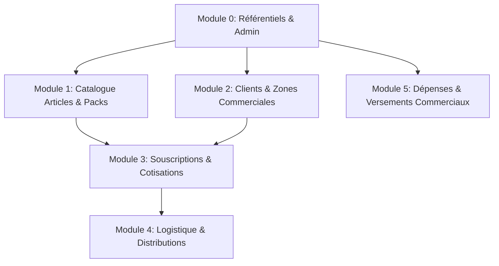

# Implementation Plan - Modules CRUD Olive Service

Ce plan d'implémentation définit l'architecture, le découpage par modules dépendant des tables de la base `olive`, et l'organisation des CRUDs (Controllers, Models, Views, Routes) tout en conservant l'architecture MVC d'origine (`BaseController`, `BaseModel`, `Router`, `PrincipalRoute`, `const.php`) et la charte graphique/UI du projet d'origine.

## User Review Required

> [!IMPORTANT]
> Les tables de la base de données `olive` servent de référence exacte pour le projet **Olive Service**. Nous allons construire/adapter les modules CRUD par ordre logique de dépendance (des tables de base vers les opérations transactions/souscriptions).
> Les tâches terminées seront marquées avec la mention **`tache clean`** dans le fichier `liste_tache.md`.

---

## Découpage des Modules par Ordre de Dépendance

### Module 0 : Référentiels de Base & Administration Système (Fondations)
*Tables :* `etablissements`, `annees`, `sessions`, `zones`, `fonctions`, `roles`, `permissions`, `users`
*Rôle :* Assurer la configuration globale de l'entité, les exercices (sessions/années), les zones d'intervention et l'authentification/droits d'accès.

### Module 1 : Catalogue Produits, Catégories & Packs
*Tables :* `articles`, `categorie_packs`, `packs`, `pack_articles`
*Rôle :* Gérer les articles individuels (riz, électricité, appareils, jouets), les catégories de packs (*Alimentaire, Noël, Électroménager*), la constitution des packs et la composition `pack_articles`.

### Module 2 : Gestion des Clients & Zones Commerciales
*Tables :* `clients`, `zone_commercials`
*Rôle :* Gérer le registre des clients (coordonnées, CNI, zone d'appartenance) et l'affectation des agents commerciaux aux zones.

### Module 3 : Souscriptions & Cotisations Clients (Cœur Métier)
*Tables :* `souscriptions`, `pack_souscriptions`, `cautisation_clients`
*Rôle :* Enregistrer les souscriptions des clients aux packs, associer les packs souscrits et effectuer le suivi quotidien/périodique des cotisations (*versements, calcul des jours, validation*).

### Module 4 : Logistique & Distributions
*Tables :* `distributions`
*Rôle :* Suivre l'état de livraison/remise des packs aux clients ayant soldé ou validé leurs souscriptions.

### Module 5 : Comptabilité, Dépenses & Versements Commerciaux
*Tables :* `type_depenses`, `depenses`, `paiements`, `versements_commerciaux`
*Rôle :* Enregistrer les charges opérationnelles, valider les versements des agents commerciaux et suivre la caisse globale.

---

## Core Adjustments & Architecture Updates

#### [MODIFY] [const.php](file:///var/www/html/geicg/config/const.php)
* Adapter `TITLE`, `LOGO` pour **Olive Service**.
* Mettre à jour la classe `TABLES` pour refléter exactement les 24 tables d'Olive Service (`PACKS`, `ARTICLES`, `CATEGORIE_PACKS`, `PACK_ARTICLES`, `SOUSCRIPTIONS`, `PACK_SOUSCRIPTIONS`, `CAUTISATION_CLIENTS`, `DISTRIBUTIONS`, `ZONES`, `ZONE_COMMERCIALS`, `VERSEMENTS_COMMERCIAUX`, etc.).
* Définir les constantes de statut métier (`STATUTS::SOUSCRIPTIONS`, `STATUTS::CAUTISATIONS`, `STATUTS::DISTRIBUTIONS`, etc.).

#### [MODIFY] [PrincipalRoute.php](file:///var/www/html/geicg/core/PrincipalRoute.php)
* Inclure les nouveaux modèles et contrôleurs pour les entités Olive Service (`ModelPack`, `PackController`, `ModelSouscription`, `SouscriptionController`, `ModelCotisation`, `CotisationController`, `ModelZone`, `ZoneController`, `ModelDistribution`, `DistributionController`, `ModelVersementCommercial`, `VersementCommercialController`).

#### [MODIFY] [index.php](file:///var/www/html/geicg/public/index.php)
* Enregistrer les routes REST/MVC pour chaque nouveau module (`/pack/*`, `/souscription/*`, `/cotisation/*`, `/zone/*`, `/distribution/*`, `/versement_commercial/*`, etc.).

#### [NEW] [liste_tache.md](file:///var/www/html/geicg/liste_tache.md)
* Créer le fichier de suivi des tâches demandé à la racine du projet, dans lequel chaque tâche finalisée sera marquée comme `[tache clean]`.

---

## Verification Plan

### Automated / Command Verification
* Tester le chargement PHP et la syntaxe de chaque contrôleur/modèle créé (`php -l <fichier.php>`).
* Vérifier le bon fonctionnement et l'absence d'erreurs de syntaxe sur toutes les routes.

### Manual Verification
* Naviguer sur le dashboard et les sous-menus pour valider la conservation des interfaces graphiques (CSS, Modals, DataTables, Formulaires d'édition/création).
